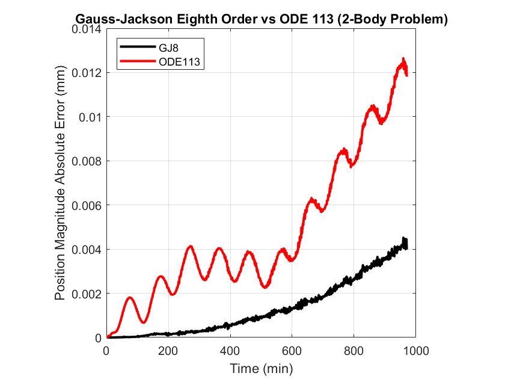

# Matlab Gauss-Jackson Integrator

The Matlab code was written by Darin Koblick (2012):

Darin Koblick (2022). Gauss-Jackson Eighth-Order ODE Solver (Fixed Step Size) (https://www.mathworks.com/matlabcentral/fileexchange/36542-gauss-jackson-eighth-order-ode-solver-fixed-step-size), MATLAB Central File Exchange. Retrieved October 28, 2022.

